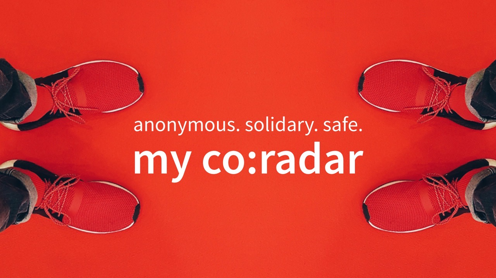
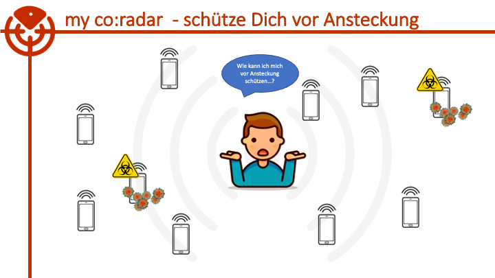

# my co:radar
anonym. solidarisch. sicher.

## Zweck
Es soll im Rahmen des Hackathon [#WirVsVirus](https://wirvsvirushackathon.org/) 2020 eine Lösung entwickelt werden, die bei der Eindämmung der Krankheit COVID-19 unterstützt. #flattenthecurve #riskgoups 

## Unsere Idee
Wir möchten über Mobiltelefone ermitteln, ob ein Anwender sich eine bestimmte Zeit in einer bestimmten Nähe zu einem mit SARS-CoV-2 infizierten Menschen aufgehalten hat.

Laut Empfehlung sollte die Entfernung mehr als 2 Meter und nicht länger als 15 Minuten erfolgen. Befindet man sich eine längere Zeit oder dichter an einer infizierten Person, besteht die Möglichkeit, sich ebenfalls zu infizieren.

Mit der von uns vorgesehenen Lösung werden von einem Gerät alle eindeutigen Kennzeichen (IDs) der Geräte in der Umgebung gescannt. Von einem zentralen Server-Dienst werden als infektiös bekannte IDs gelesen und der Anwender vor einer potentiellen Ansteckung gewarnt, um so die Infektionskette zu unterbrechen.

Wird eine ID erst zu einem späteren Zeitpunkt als infektiös markiert, werden alle früher mit dieser ID in Kontakt stehenden Anwender informiert. Diese Information erfolgt durch eine client-seitige Synchronisierung der Liste mit der als infektiös bekannten IDs.

Meldet ein Anwender sich selber als infektiös, wird seine ID an den Server übertragen und alle mit ihm in Kontakt gestandenen Anwender über den zuvor beschriebenen Mechanismus informiert.

## Features
- Erfassung einer eindeutigen anonymen ID des Geräts
- keine Erfassung von personengebundenen Informationen
- Übertragung der Informationen über verschlüselte Protokolle (in Arbeit)
- ...

## Voraussetzung
- Smartphones
- Einsatz der Anwendung "my co:radar" auf den betroffenen Endgeräten
- Einsatz des Backends für den Austausch der als infektiös identifizierten Anwender
- Internet-Verbindung zur Datensynchronisierung

## Die Technik:
**App**  
- Angular  
- Springboot  
- REST  
- JSON  

**Design**  
- Adobe Spark Post  
- proto.io  

**Kommunikation**  
- Slack
- menti.com
- Zoom

## Der Datenschutz

Die Lösung ermittelt eine eindeutige ID des Geräts und nutzt diese zum Austauch mit anderen Geräten.

...
