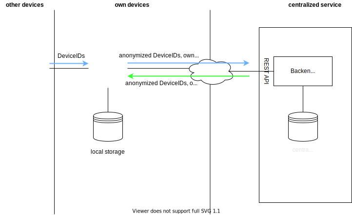

**Hinweis:** Diese Seite ist derzeit nur in deutscher Sprache formuliert, da es sich bei dem Hackathon #WirVsVirus um eine Veranstaltung des Bundes handelt. Eine Übersetzung ins Englisch ist während oder kurz nach dem Hackathon vorgesehen

# my co:radar
anonym. solidarisch. sicher.

Eine innovative Lösung für den solidarischen Schutz unserer Gemeinschaft. Anonyme Nutzung sichergestellt und sicher für Deine Gesundheit.

## Zweck
Es wurde im Rahmen des Hackathon #WirVsVirus in 2020 eine Lösung entwickelt werden, die bei der Eindämmung der Krankheit COVID-19 unterstützt.  

Die Lösung unterstützt Anwender dabei, ihre physischen Kontakte im Blick zu behalten und bei einer Infektion mit COVID-19 sich und andere rechtzeitig zu informieren. Ziel ist die frühzeitige Unterbrechung der Infektionskette und die Eindämmung der Verbreitung von SARS-CoV-2, damit unser Gesundheitssystem den Kollaps übersteht. Der Einsatz erfolgt dabei konform den Aspekten des Datenschutzes (GDPR/EU-DSGVO).  

## Unsere Idee
Unsere Lösung ermittelt über eindeutige Kennungen von Smartphones, ob sich ein Anwender gemäß den Richtwerten des [Robert-Koch-Instituts (RKI)](https://www.rki.de/) zu lange und zu dicht bei einer mit SARS-CoV-2 infizierten Person aufgehalten hat.  

Hierzu prüft die Lösung gemäß der Empfehlung folgende Bedingungen:  

- mindestens zwei Meter Abstand zu anderen Personen halten und   
- nicht länger als 15 Minuten in der Nähe von infizierten Personen aufhalten.  

Ansonsten könnte die Möglichkeit einer Ansteckung für den Anwender bestehen.  

Hinweis: Sollte ein zuvor positiv getesteter Anwender wieder genesen, kann der Status durch den Benutzer wieder zurückgesetzt werden, so dass keine fehlerhafte Benachrichtigung zu späteren Zeitpunkten erfolgt.  

## Technische Umsetzung  

Mit der von uns vorgesehenen Lösung werden von dem eigenen Gerät alle Geräte in der Umgebung protokolliert. Die IDs werden ermittelt und als anonyme Kennzeichnung gespeichert.

Von einem zentralen Server-Dienst werden Geräte-IDs von positiv getesteten Nutzern gelesen und der Anwender wird vor einer potentiellen Ansteckung gewarnt, um so die Infektionskette zu unterbrechen.

Wird eine ID erst zu einem späteren Zeitpunkt als infektiös markiert, werden alle früher mit dieser ID in Kontakt stehenden Anwender informiert. Diese Information erfolgt durch eine client-seitige Synchronisierung der Liste mit der als infektiös bekannten IDs.

Meldet ein Anwender sich selber als infektiös, wird seine ID an den Server übertragen und alle mit ihm in Kontakt gestandenen Anwender über den zuvor beschriebenen Mechanismus informiert.

## Implementierte Features
- Erfassung einer eindeutigen anonymen ID des Geräts
- keine Erfassung von personengebundenen Informationen
- Übertragung der Informationen über verschlüsselte Protokolle (in Arbeit)
- ...

(noch nicht implementierte Features werden im Abschnitt "Ausblick" für weitere AUsbaustufen nach dem Hackathon beschrieben))

## Technische Voraussetzung
### Komponenten
### Client
- mindestens zwei **Smartphones** (derzeit Android)
- **Einsatz der Anwendung "my co:radar"** auf den betroffenen Endgeräten (eine Erfassung der Geräte-IDs ist mit einem Endgerät möglich, jedoch ist die Erfassung und Auswertung einer Statusänderung nur mit einem zweiten Gerät sinnvoll - ohne in die Datenhaltung eingreifen zu müssen)

### Server
- Server per Internet erreichbar
- Docker
- Einsatz der **Backend-Komponente** für den Austausch der als infektiös identifizierten Anwender (Docker Image)
- **Internet-Verbindung** zur Datensynchronisierung

### Programmiersprachen, Frameworks etc.
- Angular  
- Springboot  
- REST  
- JSON  
- Docker  

## Datenschutz

Die Lösung ermittelt eine eindeutige ID des Geräts, **anonymisiert** diese und nutzt diese anonymisierte Information zum Abgleich der Daten von anderen Geräten.

Die Verarbeitung der Daten erfolgt vorrangig auf dem **lokalen Endgerät** des Benutzers. Alle im Umfeld des Benutzers identifizierten Geräte-IDs, **die den Bedingungen für eine potentielle Infektion entsprechen(!!!)**, werden **anonymisiert verarbeitet und lokal gespeichert**.

In regelmäßigen Abständen erfolgt eine Synchronisierung mit der Server-Komponente, um eine Liste mit (ebenfalls anonymisierten) Geräte-IDs zu ermiteln. Bei den IDs handelt es sich um Kennungen von Geräten, deren Benutzer positiv getestet worden sind. Kann zwischen dieser Liste und den lokal gespeicherten Daten eine **Übereinstimmung gefunden werden, wird dem Anwender eine Hinweismeldung mit Handlungsempfehlungen angezeigt**. Es erfolgt **keine Anzeige von Geräten-IDs oder dem Standort von Geräten Dritter!** 

Die Speicherung von Geräte-IDs auf den lokalen Gerät ist auf **maximal 20 Tage** (angenommene Inkubationszeit plus Karenz)begrenzt. Eine erneute Begegnung unter den Bedingungen setzt den Zeitstempel auf das aktuelle Begegnungsdatum zurück.

Wird der Status eines anderen Anwenders von vormals "infektiös" auf "genesen" (nicht mehr infektiös) geändert, wird der **Eintrag in der zentralen Datenhaltung bei der nächsten Synchronisierung entfernt**. Dieser Status wird beim nächsten Abgleich der Geräte lokale aktualisiert, eine erneute Benachrichtigung wird damit unterbunden.

Durch die Verarbeitung der Geräte-IDs in anonymisierter Form kann weder der Anwender noch der Server-Betreiber eine Verbindung zwischen Gerät (entspricht in vielen Fällen dem Nutzer) und der verarbeiteten Kennung herstellen. Hinweis: Für einen produktiven Einsatz ist das Verschlüsselungsverfahren und die Verarbeitung zu prüfen und durch den Datenschutzbeauftragten zu bestätigen!)  

# Ausblick

Die Anwendung ist als Prototyp im Rahmen des Hackathon entstanden und unter einer freien Lizenz veröffentlicht. Die Idee bzw. der technische Implementierungsansatz kann beliebig verwendet werde. Eine Weiterentwicklung nach dem Hackathon ist im Rahmen des privaten Engagement der Teilnehmer beabsichtigt. EIne Mitwirkung durch Dritte ist willkommen. Wir freuen uns über Forks und Weiuterentwicklungen im Rahmen von Pull Requests.

## nicht implementierte Funktionen
- Löschen von Kennungen inklusive Synchronsiation umsetzen
- Prüfung der Verschlüsselung und der Verarbeitung durch den Datenschutzbeauftragten
- ...
